# Database Schema & Entity Relationship Diagram

## Enhanced Database Design for Structured Documentation System

---

## 📊 Entity Relationship Diagram (Mermaid)

```mermaid
erDiagram
    users ||--o{ documents : "owns"
    users ||--o{ document_editors : "can edit"
    users ||--o{ document_reviewers : "reviews"
    users ||--o{ comments : "writes"
    users ||--o{ activities : "performs"
    users ||--o{ user_scores : "has"
    users ||--o{ score_logs : "logs"
    users ||--o{ leaderboard_cache : "ranked in"
    users ||--o{ editing_sessions : "participates"
    users ||--o{ notifications : "receives"
    users ||--o{ notification_settings : "configures"
    users ||--o{ document_watchers : "watches"
    users ||--o{ user_followers : "follows"
    
    categories ||--o{ documents : "categorizes"
    categories ||--o{ structures : "defines schema"
    
    structures ||--o{ documents : "enforces structure"
    structures ||--o{ structure_sections : "contains"
    
    structure_sections ||--o{ structure_section_items : "contains"
    structure_sections ||--o{ document_sections : "instantiates"
    structure_sections ||--o{ document_editor_sections : "limits access"
    
    structure_section_items ||--o{ document_section_items : "populated by"
    
    documents ||--o{ document_sections : "has"
    documents ||--o{ document_editors : "has editors"
    documents ||--o{ document_reviewers : "has reviewers"
    documents ||--o{ review_scores : "receives"
    documents ||--o{ document_versions : "versioned"
    documents ||--o{ document_changes : "tracks changes"
    documents ||--o{ comments : "has"
    documents ||--o{ document_views : "tracked views"
    documents ||--o{ reactions : "receives"
    documents ||--o{ document_penalties : "penalized"
    documents ||--o{ document_branches : "has branches"
    documents ||--o{ external_links : "links to"
    documents ||--o{ document_approvals : "approval workflow"
    documents ||--o{ integration_sync_logs : "syncs with"
    documents ||--o{ document_watchers : "watched by"
    documents ||--o{ document_tag : "tagged"
    documents ||--o{ document_references : "references"
    
    document_sections ||--o{ document_section_items : "contains"
    document_sections ||--o{ comments : "commented on"
    
    document_section_items ||--o{ document_changes : "changed"
    document_section_items ||--o{ comments : "inline comments"
    
    document_editors ||--o{ document_editor_sections : "section access"
    
    tags ||--o{ document_tag : "tags documents"
    
    outdated_rules ||--o{ document_penalties : "triggers"
```



---

## 📋 Complete Table Definitions

### **Core Entities**

#### `users`
```sql
CREATE TABLE users (
    id BIGINT UNSIGNED PRIMARY KEY AUTO_INCREMENT,
    name VARCHAR(255) NOT NULL,
    email VARCHAR(255) UNIQUE NOT NULL,
    email_verified_at TIMESTAMP NULL,
    password VARCHAR(255) NOT NULL,
    avatar VARCHAR(255) NULL,
    telegram_chat_id VARCHAR(255) NULL,
    total_score INT DEFAULT 0,
    current_rank INT NULL,
    remember_token VARCHAR(100) NULL,
    created_at TIMESTAMP NULL,
    updated_at TIMESTAMP NULL,
    
    INDEX idx_users_email (email),
    INDEX idx_users_total_score (total_score DESC)
);
```

#### `categories`
```sql
CREATE TABLE categories (
    id BIGINT UNSIGNED PRIMARY KEY AUTO_INCREMENT,
    name VARCHAR(255) NOT NULL,
    slug VARCHAR(255) UNIQUE NOT NULL,
    description TEXT NULL,
    icon VARCHAR(100) NULL,
    color VARCHAR(7) NULL, -- Hex color
    is_active BOOLEAN DEFAULT TRUE,
    created_at TIMESTAMP NULL,
    updated_at TIMESTAMP NULL,
    
    INDEX idx_categories_slug (slug)
);
```

#### `tags`
```sql
CREATE TABLE tags (
    id BIGINT UNSIGNED PRIMARY KEY AUTO_INCREMENT,
    name VARCHAR(100) NOT NULL UNIQUE,
    slug VARCHAR(100) NOT NULL UNIQUE,
    usage_count INT UNSIGNED DEFAULT 0,
    created_at TIMESTAMP NULL,
    updated_at TIMESTAMP NULL,
    
    INDEX idx_tags_name (name),
    INDEX idx_tags_usage (usage_count DESC)
);
```

---

### **Structure/Schema System**

#### `structures`
```sql
CREATE TABLE structures (
    id BIGINT UNSIGNED PRIMARY KEY AUTO_INCREMENT,
    category_id BIGINT UNSIGNED NULL, -- NULL = reusable across categories
    title VARCHAR(255) NOT NULL,
    description TEXT NULL,
    version INT DEFAULT 1,
    is_active BOOLEAN DEFAULT TRUE,
    is_default BOOLEAN DEFAULT FALSE,
    created_at TIMESTAMP NULL,
    updated_at TIMESTAMP NULL,
    
    FOREIGN KEY (category_id) REFERENCES categories(id) ON DELETE CASCADE,
    INDEX idx_structures_category (category_id),
    INDEX idx_structures_active (is_active)
);
```

#### `structure_sections`
```sql
CREATE TABLE structure_sections (
    id BIGINT UNSIGNED PRIMARY KEY AUTO_INCREMENT,
    structure_id BIGINT UNSIGNED NOT NULL,
    title VARCHAR(255) NOT NULL,
    description TEXT NULL,
    position INT UNSIGNED NOT NULL DEFAULT 0,
    is_required BOOLEAN DEFAULT FALSE,
    is_repeatable BOOLEAN DEFAULT FALSE, -- Can have multiple instances
    min_items INT UNSIGNED DEFAULT 0,
    max_items INT UNSIGNED NULL,
    created_at TIMESTAMP NULL,
    updated_at TIMESTAMP NULL,
    
    FOREIGN KEY (structure_id) REFERENCES structures(id) ON DELETE CASCADE,
    INDEX idx_structure_sections_structure (structure_id),
    INDEX idx_structure_sections_position (position)
);
```

#### `structure_section_items`
```sql
CREATE TABLE structure_section_items (
    id BIGINT UNSIGNED PRIMARY KEY AUTO_INCREMENT,
    section_id BIGINT UNSIGNED NOT NULL,
    label VARCHAR(255) NOT NULL,
    description TEXT NULL,
    type ENUM('text', 'textarea', 'rich_text', 'number', 'date', 'select', 'multiselect', 'checkbox', 'radio', 'file', 'image', 'link', 'reference', 'code', 'checklist') NOT NULL,
    is_required BOOLEAN DEFAULT FALSE,
    validation_rules JSON NULL, -- {"min": 10, "max": 500, "pattern": "regex", "options": [...]}
    placeholder VARCHAR(255) NULL,
    default_value TEXT NULL,
    position INT UNSIGNED NOT NULL DEFAULT 0,
    created_at TIMESTAMP NULL,
    updated_at TIMESTAMP NULL,
    
    FOREIGN KEY (section_id) REFERENCES structure_sections(id) ON DELETE CASCADE,
    INDEX idx_structure_items_section (section_id),
    INDEX idx_structure_items_position (position)
);
```

---

### **Document Management**

#### `documents`
```sql
CREATE TABLE documents (
    id BIGINT UNSIGNED PRIMARY KEY AUTO_INCREMENT,
    title VARCHAR(500) NOT NULL,
    slug VARCHAR(500) UNIQUE NOT NULL,
    description TEXT NULL,
    image VARCHAR(255) NULL,
    category_id BIGINT UNSIGNED NOT NULL,
    structure_id BIGINT UNSIGNED NOT NULL,
    owner_id BIGINT UNSIGNED NOT NULL,
    visibility ENUM('public', 'private', 'team') DEFAULT 'private',
    status ENUM('draft', 'pending_review', 'published', 'completed', 'stale', 'archived') DEFAULT 'draft',
    approval_status ENUM('not_submitted', 'pending', 'approved', 'rejected') DEFAULT 'not_submitted',
    total_score INT DEFAULT 0,
    completeness_percentage DECIMAL(5,2) DEFAULT 0.00, -- 0-100
    view_count INT UNSIGNED DEFAULT 0,
    comment_count INT UNSIGNED DEFAULT 0,
    reaction_count INT UNSIGNED DEFAULT 0,
    last_activity_at TIMESTAMP NULL,
    published_at TIMESTAMP NULL,
    first_published_at TIMESTAMP NULL,
    completed_at TIMESTAMP NULL,
    stale_detected_at TIMESTAMP NULL,
    created_at TIMESTAMP NULL,
    updated_at TIMESTAMP NULL,
    deleted_at TIMESTAMP NULL, -- Soft deletes
    
    FOREIGN KEY (category_id) REFERENCES categories(id) ON DELETE RESTRICT,
    FOREIGN KEY (structure_id) REFERENCES structures(id) ON DELETE RESTRICT,
    FOREIGN KEY (owner_id) REFERENCES users(id) ON DELETE RESTRICT,
    
    INDEX idx_documents_category (category_id),
    INDEX idx_documents_owner (owner_id),
    INDEX idx_documents_status (status),
    INDEX idx_documents_visibility (visibility),
    INDEX idx_documents_total_score (total_score DESC),
    INDEX idx_documents_created_at (created_at DESC),
    INDEX idx_documents_last_activity (last_activity_at DESC),
    FULLTEXT idx_documents_search (title, description)
);
```

#### `document_sections`
```sql
CREATE TABLE document_sections (
    id BIGINT UNSIGNED PRIMARY KEY AUTO_INCREMENT,
    document_id BIGINT UNSIGNED NOT NULL,
    structure_section_id BIGINT UNSIGNED NOT NULL,
    instance_number INT UNSIGNED DEFAULT 1, -- For repeatable sections
    is_complete BOOLEAN DEFAULT FALSE,
    position INT UNSIGNED NOT NULL DEFAULT 0,
    created_at TIMESTAMP NULL,
    updated_at TIMESTAMP NULL,
    
    FOREIGN KEY (document_id) REFERENCES documents(id) ON DELETE CASCADE,
    FOREIGN KEY (structure_section_id) REFERENCES structure_sections(id) ON DELETE RESTRICT,
    INDEX idx_document_sections_document (document_id),
    INDEX idx_document_sections_structure (structure_section_id)
);
```

#### `document_section_items`
```sql
CREATE TABLE document_section_items (
    id BIGINT UNSIGNED PRIMARY KEY AUTO_INCREMENT,
    document_section_id BIGINT UNSIGNED NOT NULL,
    structure_section_item_id BIGINT UNSIGNED NOT NULL,
    content LONGTEXT NULL, -- Can store JSON for complex types
    is_valid BOOLEAN DEFAULT TRUE,
    validation_errors JSON NULL,
    last_edited_by BIGINT UNSIGNED NULL,
    last_edited_at TIMESTAMP NULL,
    created_at TIMESTAMP NULL,
    updated_at TIMESTAMP NULL,
    
    FOREIGN KEY (document_section_id) REFERENCES document_sections(id) ON DELETE CASCADE,
    FOREIGN KEY (structure_section_item_id) REFERENCES structure_section_items(id) ON DELETE RESTRICT,
    FOREIGN KEY (last_edited_by) REFERENCES users(id) ON DELETE SET NULL,
    
    INDEX idx_document_items_section (document_section_id),
    INDEX idx_document_items_structure (structure_section_item_id),
    INDEX idx_document_items_last_edited (last_edited_by),
    FULLTEXT idx_document_items_content (content)
);
```

#### `document_tag`
```sql
CREATE TABLE document_tag (
    id BIGINT UNSIGNED PRIMARY KEY AUTO_INCREMENT,
    document_id BIGINT UNSIGNED NOT NULL,
    tag_id BIGINT UNSIGNED NOT NULL,
    created_at TIMESTAMP NULL,
    
    FOREIGN KEY (document_id) REFERENCES documents(id) ON DELETE CASCADE,
    FOREIGN KEY (tag_id) REFERENCES tags(id) ON DELETE CASCADE,
    UNIQUE KEY unique_document_tag (document_id, tag_id),
    INDEX idx_document_tag_document (document_id),
    INDEX idx_document_tag_tag (tag_id)
);
```

---

### **Permissions & Access Control**

#### `document_editors`
```sql
CREATE TABLE document_editors (
    id BIGINT UNSIGNED PRIMARY KEY AUTO_INCREMENT,
    document_id BIGINT UNSIGNED NOT NULL,
    user_id BIGINT UNSIGNED NOT NULL,
    access_type ENUM('full', 'limited') DEFAULT 'limited',
    can_manage_editors BOOLEAN DEFAULT FALSE,
    invited_by BIGINT UNSIGNED NULL,
    notified_at TIMESTAMP NULL,
    created_at TIMESTAMP NULL,
    updated_at TIMESTAMP NULL,
    
    FOREIGN KEY (document_id) REFERENCES documents(id) ON DELETE CASCADE,
    FOREIGN KEY (user_id) REFERENCES users(id) ON DELETE CASCADE,
    FOREIGN KEY (invited_by) REFERENCES users(id) ON DELETE SET NULL,
    UNIQUE KEY unique_document_editor (document_id, user_id),
    INDEX idx_document_editors_document (document_id),
    INDEX idx_document_editors_user (user_id)
);
```

#### `document_editor_sections`
```sql
CREATE TABLE document_editor_sections (
    id BIGINT UNSIGNED PRIMARY KEY AUTO_INCREMENT,
    document_editor_id BIGINT UNSIGNED NOT NULL,
    structure_section_id BIGINT UNSIGNED NOT NULL,
    created_at TIMESTAMP NULL,
    
    FOREIGN KEY (document_editor_id) REFERENCES document_editors(id) ON DELETE CASCADE,
    FOREIGN KEY (structure_section_id) REFERENCES structure_sections(id) ON DELETE CASCADE,
    UNIQUE KEY unique_editor_section (document_editor_id, structure_section_id),
    INDEX idx_editor_sections_editor (document_editor_id),
    INDEX idx_editor_sections_section (structure_section_id)
);
```

#### `document_reviewers`
```sql
CREATE TABLE document_reviewers (
    id BIGINT UNSIGNED PRIMARY KEY AUTO_INCREMENT,
    document_id BIGINT UNSIGNED NOT NULL,
    user_id BIGINT UNSIGNED NOT NULL,
    invited_by BIGINT UNSIGNED NULL,
    status ENUM('pending', 'accepted', 'declined') DEFAULT 'pending',
    notified_at TIMESTAMP NULL,
    responded_at TIMESTAMP NULL,
    created_at TIMESTAMP NULL,
    updated_at TIMESTAMP NULL,
    
    FOREIGN KEY (document_id) REFERENCES documents(id) ON DELETE CASCADE,
    FOREIGN KEY (user_id) REFERENCES users(id) ON DELETE CASCADE,
    FOREIGN KEY (invited_by) REFERENCES users(id) ON DELETE SET NULL,
    UNIQUE KEY unique_document_reviewer (document_id, user_id),
    INDEX idx_document_reviewers_document (document_id),
    INDEX idx_document_reviewers_user (user_id)
);
```

---

### **Review & Approval System**

#### `review_scores`
```sql
CREATE TABLE review_scores (
    id BIGINT UNSIGNED PRIMARY KEY AUTO_INCREMENT,
    document_id BIGINT UNSIGNED NOT NULL,
    reviewer_id BIGINT UNSIGNED NOT NULL,
    score INT NOT NULL, -- 0-100
    reason TEXT NULL,
    is_admin_score BOOLEAN DEFAULT FALSE,
    notified_at TIMESTAMP NULL,
    created_at TIMESTAMP NULL,
    updated_at TIMESTAMP NULL,
    
    FOREIGN KEY (document_id) REFERENCES documents(id) ON DELETE CASCADE,
    FOREIGN KEY (reviewer_id) REFERENCES users(id) ON DELETE CASCADE,
    INDEX idx_review_scores_document (document_id),
    INDEX idx_review_scores_reviewer (reviewer_id),
    INDEX idx_review_scores_score (score DESC)
);
```

#### `document_approvals`
```sql
CREATE TABLE document_approvals (
    id BIGINT UNSIGNED PRIMARY KEY AUTO_INCREMENT,
    document_id BIGINT UNSIGNED NOT NULL,
    submitted_by BIGINT UNSIGNED NOT NULL,
    status ENUM('pending', 'approved', 'rejected') DEFAULT 'pending',
    required_score INT DEFAULT 70,
    actual_score INT DEFAULT 0,
    required_reviewers INT DEFAULT 2,
    actual_reviewers INT DEFAULT 0,
    approved_by BIGINT UNSIGNED NULL,
    approved_at TIMESTAMP NULL,
    rejection_reason TEXT NULL,
    created_at TIMESTAMP NULL,
    updated_at TIMESTAMP NULL,
    
    FOREIGN KEY (document_id) REFERENCES documents(id) ON DELETE CASCADE,
    FOREIGN KEY (submitted_by) REFERENCES users(id) ON DELETE RESTRICT,
    FOREIGN KEY (approved_by) REFERENCES users(id) ON DELETE SET NULL,
    INDEX idx_approvals_document (document_id),
    INDEX idx_approvals_status (status)
);
```

---

### **Version Control & History**

#### `document_versions`
```sql
CREATE TABLE document_versions (
    id BIGINT UNSIGNED PRIMARY KEY AUTO_INCREMENT,
    document_id BIGINT UNSIGNED NOT NULL,
    version INT UNSIGNED NOT NULL,
    snapshot JSON NOT NULL, -- Full document state
    created_by BIGINT UNSIGNED NOT NULL,
    change_summary VARCHAR(500) NULL,
    is_major BOOLEAN DEFAULT FALSE,
    created_at TIMESTAMP NULL,
    
    FOREIGN KEY (document_id) REFERENCES documents(id) ON DELETE CASCADE,
    FOREIGN KEY (created_by) REFERENCES users(id) ON DELETE RESTRICT,
    INDEX idx_versions_document (document_id),
    INDEX idx_versions_created_at (created_at DESC)
);
```

#### `document_changes`
```sql
CREATE TABLE document_changes (
    id BIGINT UNSIGNED PRIMARY KEY AUTO_INCREMENT,
    document_id BIGINT UNSIGNED NOT NULL,
    section_item_id BIGINT UNSIGNED NULL,
    user_id BIGINT UNSIGNED NOT NULL,
    change_type ENUM('create', 'update', 'delete') NOT NULL,
    old_content LONGTEXT NULL,
    new_content LONGTEXT NULL,
    diff TEXT NULL, -- Unified diff format
    line_number INT NULL,
    created_at TIMESTAMP NULL,
    
    FOREIGN KEY (document_id) REFERENCES documents(id) ON DELETE CASCADE,
    FOREIGN KEY (section_item_id) REFERENCES document_section_items(id) ON DELETE SET NULL,
    FOREIGN KEY (user_id) REFERENCES users(id) ON DELETE RESTRICT,
    INDEX idx_changes_document (document_id),
    INDEX idx_changes_section_item (section_item_id),
    INDEX idx_changes_user (user_id),
    INDEX idx_changes_created_at (created_at DESC)
);
```

---

### **Collaboration**

#### `editing_sessions`
```sql
CREATE TABLE editing_sessions (
    id BIGINT UNSIGNED PRIMARY KEY AUTO_INCREMENT,
    document_id BIGINT UNSIGNED NOT NULL,
    user_id BIGINT UNSIGNED NOT NULL,
    section_id BIGINT UNSIGNED NULL,
    session_token VARCHAR(255) NOT NULL UNIQUE,
    cursor_position JSON NULL,
    is_active BOOLEAN DEFAULT TRUE,
    last_activity_at TIMESTAMP NULL,
    started_at TIMESTAMP NULL,
    ended_at TIMESTAMP NULL,
    
    FOREIGN KEY (document_id) REFERENCES documents(id) ON DELETE CASCADE,
    FOREIGN KEY (user_id) REFERENCES users(id) ON DELETE CASCADE,
    FOREIGN KEY (section_id) REFERENCES document_sections(id) ON DELETE CASCADE,
    INDEX idx_sessions_document (document_id),
    INDEX idx_sessions_active (is_active, last_activity_at)
);
```

#### `comments`
```sql
CREATE TABLE comments (
    id BIGINT UNSIGNED PRIMARY KEY AUTO_INCREMENT,
    document_id BIGINT UNSIGNED NOT NULL,
    parent_id BIGINT UNSIGNED NULL, -- For threaded comments
    section_item_id BIGINT UNSIGNED NULL, -- Inline comment
    user_id BIGINT UNSIGNED NOT NULL,
    content TEXT NOT NULL,
    is_resolved BOOLEAN DEFAULT FALSE,
    resolved_by BIGINT UNSIGNED NULL,
    resolved_at TIMESTAMP NULL,
    created_at TIMESTAMP NULL,
    updated_at TIMESTAMP NULL,
    deleted_at TIMESTAMP NULL,
    
    FOREIGN KEY (document_id) REFERENCES documents(id) ON DELETE CASCADE,
    FOREIGN KEY (parent_id) REFERENCES comments(id) ON DELETE CASCADE,
    FOREIGN KEY (section_item_id) REFERENCES document_section_items(id) ON DELETE CASCADE,
    FOREIGN KEY (user_id) REFERENCES users(id) ON DELETE CASCADE,
    FOREIGN KEY (resolved_by) REFERENCES users(id) ON DELETE SET NULL,
    INDEX idx_comments_document (document_id),
    INDEX idx_comments_section_item (section_item_id),
    INDEX idx_comments_user (user_id),
    INDEX idx_comments_created_at (created_at DESC)
);
```

#### `comment_mentions`
```sql
CREATE TABLE comment_mentions (
    id BIGINT UNSIGNED PRIMARY KEY AUTO_INCREMENT,
    comment_id BIGINT UNSIGNED NOT NULL,
    user_id BIGINT UNSIGNED NOT NULL,
    notified_at TIMESTAMP NULL,
    created_at TIMESTAMP NULL,
    
    FOREIGN KEY (comment_id) REFERENCES comments(id) ON DELETE CASCADE,
    FOREIGN KEY (user_id) REFERENCES users(id) ON DELETE CASCADE,
    UNIQUE KEY unique_comment_mention (comment_id, user_id),
    INDEX idx_mentions_user (user_id)
);
```

---

### **Engagement & Analytics**

#### `document_views`
```sql
CREATE TABLE document_views (
    id BIGINT UNSIGNED PRIMARY KEY AUTO_INCREMENT,
    document_id BIGINT UNSIGNED NOT NULL,
    user_id BIGINT UNSIGNED NULL, -- NULL for anonymous
    ip_address VARCHAR(45) NULL,
    user_agent VARCHAR(500) NULL,
    time_spent INT UNSIGNED NULL, -- seconds
    created_at TIMESTAMP NULL,
    
    FOREIGN KEY (document_id) REFERENCES documents(id) ON DELETE CASCADE,
    FOREIGN KEY (user_id) REFERENCES users(id) ON DELETE SET NULL,
    INDEX idx_views_document (document_id),
    INDEX idx_views_user (user_id),
    INDEX idx_views_created_at (created_at DESC)
);
```

#### `reactions`
```sql
CREATE TABLE reactions (
    id BIGINT UNSIGNED PRIMARY KEY AUTO_INCREMENT,
    document_id BIGINT UNSIGNED NOT NULL,
    user_id BIGINT UNSIGNED NOT NULL,
    type ENUM('like', 'dislike', 'helpful', 'outdated', 'love', 'celebrate') NOT NULL,
    created_at TIMESTAMP NULL,
    updated_at TIMESTAMP NULL,
    
    FOREIGN KEY (document_id) REFERENCES documents(id) ON DELETE CASCADE,
    FOREIGN KEY (user_id) REFERENCES users(id) ON DELETE CASCADE,
    UNIQUE KEY unique_user_reaction (document_id, user_id, type),
    INDEX idx_reactions_document (document_id),
    INDEX idx_reactions_user (user_id),
    INDEX idx_reactions_type (type)
);
```

#### `document_watchers`
```sql
CREATE TABLE document_watchers (
    id BIGINT UNSIGNED PRIMARY KEY AUTO_INCREMENT,
    document_id BIGINT UNSIGNED NOT NULL,
    user_id BIGINT UNSIGNED NOT NULL,
    created_at TIMESTAMP NULL,
    
    FOREIGN KEY (document_id) REFERENCES documents(id) ON DELETE CASCADE,
    FOREIGN KEY (user_id) REFERENCES users(id) ON DELETE CASCADE,
    UNIQUE KEY unique_document_watcher (document_id, user_id),
    INDEX idx_watchers_document (document_id),
    INDEX idx_watchers_user (user_id)
);
```

---

### **Document References & Links**

#### `document_references`
```sql
CREATE TABLE document_references (
    id BIGINT UNSIGNED PRIMARY KEY AUTO_INCREMENT,
    source_document_id BIGINT UNSIGNED NOT NULL,
    target_document_id BIGINT UNSIGNED NOT NULL,
    context TEXT NULL, -- Where/why it's referenced
    created_at TIMESTAMP NULL,
    
    FOREIGN KEY (source_document_id) REFERENCES documents(id) ON DELETE CASCADE,
    FOREIGN KEY (target_document_id) REFERENCES documents(id) ON DELETE CASCADE,
    UNIQUE KEY unique_reference (source_document_id, target_document_id),
    INDEX idx_references_source (source_document_id),
    INDEX idx_references_target (target_document_id)
);
```

#### `document_branches`
```sql
CREATE TABLE document_branches (
    id BIGINT UNSIGNED PRIMARY KEY AUTO_INCREMENT,
    document_id BIGINT UNSIGNED NOT NULL,
    task_id VARCHAR(100) NOT NULL, -- Jira task ID
    task_title VARCHAR(500) NULL,
    branch_name VARCHAR(255) NOT NULL,
    repository_url VARCHAR(500) NULL,
    merged_at TIMESTAMP NULL,
    created_at TIMESTAMP NULL,
    updated_at TIMESTAMP NULL,
    
    FOREIGN KEY (document_id) REFERENCES documents(id) ON DELETE CASCADE,
    INDEX idx_branches_document (document_id),
    INDEX idx_branches_task_id (task_id),
    INDEX idx_branches_branch_name (branch_name)
);
```

#### `external_links`
```sql
CREATE TABLE external_links (
    id BIGINT UNSIGNED PRIMARY KEY AUTO_INCREMENT,
    document_id BIGINT UNSIGNED NOT NULL,
    type ENUM('jira', 'gitlab_mr', 'gitlab_wiki', 'confluence', 'custom') NOT NULL,
    url TEXT NOT NULL,
    title VARCHAR(500) NULL,
    is_valid BOOLEAN DEFAULT TRUE,
    last_validated_at TIMESTAMP NULL,
    meta JSON NULL, -- Additional metadata
    created_at TIMESTAMP NULL,
    updated_at TIMESTAMP NULL,
    
    FOREIGN KEY (document_id) REFERENCES documents(id) ON DELETE CASCADE,
    INDEX idx_external_links_document (document_id),
    INDEX idx_external_links_type (type)
);
```

---

### **Gamification System**

#### `user_scores`
```sql
CREATE TABLE user_scores (
    id BIGINT UNSIGNED PRIMARY KEY AUTO_INCREMENT,
    user_id BIGINT UNSIGNED NOT NULL UNIQUE,
    total_score INT DEFAULT 0,
    docs_written_score INT DEFAULT 0,
    reviews_score INT DEFAULT 0,
    engagement_score INT DEFAULT 0,
    penalty_score INT DEFAULT 0,
    grade ENUM('S', 'A', 'B', 'C', 'D', 'F') DEFAULT 'F',
    updated_at TIMESTAMP NULL,
    
    FOREIGN KEY (user_id) REFERENCES users(id) ON DELETE CASCADE,
    INDEX idx_user_scores_total (total_score DESC),
    INDEX idx_user_scores_grade (grade)
);
```

#### `score_logs`
```sql
CREATE TABLE score_logs (
    id BIGINT UNSIGNED PRIMARY KEY AUTO_INCREMENT,
    user_id BIGINT UNSIGNED NOT NULL,
    document_id BIGINT UNSIGNED NULL,
    type ENUM('doc_created', 'doc_published', 'doc_completed', 'view_received', 'comment_received', 'review_given', 'admin_score', 'penalty', 'badge_earned') NOT NULL,
    score INT NOT NULL, -- Can be negative for penalties
    reason VARCHAR(500) NULL,
    metadata JSON NULL,
    created_at TIMESTAMP NULL,
    
    FOREIGN KEY (user_id) REFERENCES users(id) ON DELETE CASCADE,
    FOREIGN KEY (document_id) REFERENCES documents(id) ON DELETE SET NULL,
    INDEX idx_score_logs_user (user_id),
    INDEX idx_score_logs_type (type),
    INDEX idx_score_logs_created_at (created_at DESC)
);
```

#### `leaderboard_cache`
```sql
CREATE TABLE leaderboard_cache (
    id BIGINT UNSIGNED PRIMARY KEY AUTO_INCREMENT,
    user_id BIGINT UNSIGNED NOT NULL UNIQUE,
    rank INT UNSIGNED NOT NULL,
    total_score INT DEFAULT 0,
    docs_written INT DEFAULT 0,
    docs_reviewed INT DEFAULT 0,
    docs_completed INT DEFAULT 0,
    penalties_received INT DEFAULT 0,
    grade ENUM('S', 'A', 'B', 'C', 'D', 'F') DEFAULT 'F',
    previous_rank INT UNSIGNED NULL,
    rank_change INT NULL, -- Positive = up, negative = down
    last_calculated_at TIMESTAMP NULL,
    
    FOREIGN KEY (user_id) REFERENCES users(id) ON DELETE CASCADE,
    INDEX idx_leaderboard_rank (rank ASC),
    INDEX idx_leaderboard_score (total_score DESC)
);
```

---

### **Outdated Detection & Penalties**

#### `outdated_rules`
```sql
CREATE TABLE outdated_rules (
    id BIGINT UNSIGNED PRIMARY KEY AUTO_INCREMENT,
    name VARCHAR(255) NOT NULL,
    description TEXT NULL,
    condition_type ENUM('days_inactive', 'jira_closed', 'branch_merged', 'link_broken', 'schema_changed') NOT NULL,
    condition_params JSON NULL, -- {"days": 30} or {"status": "Done"}
    penalty_score INT DEFAULT 0,
    is_active BOOLEAN DEFAULT TRUE,
    priority INT DEFAULT 0, -- Higher = checked first
    created_at TIMESTAMP NULL,
    updated_at TIMESTAMP NULL,
    
    INDEX idx_outdated_rules_active (is_active),
    INDEX idx_outdated_rules_priority (priority DESC)
);
```

#### `document_penalties`
```sql
CREATE TABLE document_penalties (
    id BIGINT UNSIGNED PRIMARY KEY AUTO_INCREMENT,
    document_id BIGINT UNSIGNED NOT NULL,
    rule_id BIGINT UNSIGNED NOT NULL,
    penalty_score INT NOT NULL,
    reason TEXT NULL,
    is_resolved BOOLEAN DEFAULT FALSE,
    resolved_by BIGINT UNSIGNED NULL,
    resolved_at TIMESTAMP NULL,
    applied_at TIMESTAMP NULL,
    created_at TIMESTAMP NULL,
    
    FOREIGN KEY (document_id) REFERENCES documents(id) ON DELETE CASCADE,
    FOREIGN KEY (rule_id) REFERENCES outdated_rules(id) ON DELETE RESTRICT,
    FOREIGN KEY (resolved_by) REFERENCES users(id) ON DELETE SET NULL,
    INDEX idx_penalties_document (document_id),
    INDEX idx_penalties_rule (rule_id),
    INDEX idx_penalties_resolved (is_resolved)
);
```

---

### **External Service Integration**

#### `integration_sync_logs`
```sql
CREATE TABLE integration_sync_logs (
    id BIGINT UNSIGNED PRIMARY KEY AUTO_INCREMENT,
    document_id BIGINT UNSIGNED NOT NULL,
    service ENUM('confluence', 'jira', 'gitlab') NOT NULL,
    sync_type ENUM('push', 'pull', 'bidirectional') NOT NULL,
    status ENUM('pending', 'success', 'failed', 'conflict') NOT NULL,
    external_id VARCHAR(255) NULL,
    request_payload JSON NULL,
    response_payload JSON NULL,
    error_message TEXT NULL,
    sync_duration INT NULL, -- milliseconds
    synced_by BIGINT UNSIGNED NULL,
    synced_at TIMESTAMP NULL,
    created_at TIMESTAMP NULL,
    
    FOREIGN KEY (document_id) REFERENCES documents(id) ON DELETE CASCADE,
    FOREIGN KEY (synced_by) REFERENCES users(id) ON DELETE SET NULL,
    INDEX idx_sync_logs_document (document_id),
    INDEX idx_sync_logs_service (service),
    INDEX idx_sync_logs_status (status),
    INDEX idx_sync_logs_created_at (created_at DESC)
);
```

#### `integration_mappings`
```sql
CREATE TABLE integration_mappings (
    id BIGINT UNSIGNED PRIMARY KEY AUTO_INCREMENT,
    local_entity_type VARCHAR(100) NOT NULL, -- 'document', 'user', 'category'
    local_entity_id BIGINT UNSIGNED NOT NULL,
    service ENUM('confluence', 'jira', 'gitlab') NOT NULL,
    external_entity_type VARCHAR(100) NOT NULL, -- 'page', 'issue', 'merge_request'
    external_id VARCHAR(255) NOT NULL,
    external_url TEXT NULL,
    sync_enabled BOOLEAN DEFAULT TRUE,
    last_synced_at TIMESTAMP NULL,
    created_at TIMESTAMP NULL,
    updated_at TIMESTAMP NULL,
    
    UNIQUE KEY unique_mapping (local_entity_type, local_entity_id, service, external_entity_type),
    INDEX idx_mappings_local (local_entity_type, local_entity_id),
    INDEX idx_mappings_external (service, external_id)
);
```

---

### **Notifications & Activities**

#### `notifications`
```sql
CREATE TABLE notifications (
    id BIGINT UNSIGNED PRIMARY KEY AUTO_INCREMENT,
    type VARCHAR(255) NOT NULL, -- 'App\\Notifications\\DocumentAssigned'
    notifiable_type VARCHAR(255) NOT NULL, -- 'App\\Models\\User'
    notifiable_id BIGINT UNSIGNED NOT NULL,
    data JSON NOT NULL,
    read_at TIMESTAMP NULL,
    created_at TIMESTAMP NULL,
    updated_at TIMESTAMP NULL,
    
    INDEX idx_notifications_notifiable (notifiable_type, notifiable_id),
    INDEX idx_notifications_read (read_at),
    INDEX idx_notifications_created_at (created_at DESC)
);
```

#### `notification_settings`
```sql
CREATE TABLE notification_settings (
    id BIGINT UNSIGNED PRIMARY KEY AUTO_INCREMENT,
    user_id BIGINT UNSIGNED NOT NULL,
    channel ENUM('email', 'telegram', 'in_app', 'push') NOT NULL,
    event_type VARCHAR(100) NOT NULL, -- 'doc_assigned', 'review_request', 'comment_mention', etc.
    is_enabled BOOLEAN DEFAULT TRUE,
    created_at TIMESTAMP NULL,
    updated_at TIMESTAMP NULL,
    
    FOREIGN KEY (user_id) REFERENCES users(id) ON DELETE CASCADE,
    UNIQUE KEY unique_user_channel_event (user_id, channel, event_type),
    INDEX idx_notification_settings_user (user_id)
);
```

#### `activities`
```sql
CREATE TABLE activities (
    id BIGINT UNSIGNED PRIMARY KEY AUTO_INCREMENT,
    user_id BIGINT UNSIGNED NOT NULL,
    subject_type VARCHAR(255) NOT NULL, -- 'App\\Models\\Document'
    subject_id BIGINT UNSIGNED NOT NULL,
    action VARCHAR(100) NOT NULL, -- 'created', 'updated', 'published', 'commented'
    description TEXT NULL,
    meta JSON NULL,
    ip_address VARCHAR(45) NULL,
    user_agent VARCHAR(500) NULL,
    created_at TIMESTAMP NULL,
    
    FOREIGN KEY (user_id) REFERENCES users(id) ON DELETE CASCADE,
    INDEX idx_activities_user (user_id),
    INDEX idx_activities_subject (subject_type, subject_id),
    INDEX idx_activities_action (action),
    INDEX idx_activities_created_at (created_at DESC)
);
```

---

### **Social Features**

#### `user_followers`
```sql
CREATE TABLE user_followers (
    id BIGINT UNSIGNED PRIMARY KEY AUTO_INCREMENT,
    follower_id BIGINT UNSIGNED NOT NULL,
    following_id BIGINT UNSIGNED NOT NULL,
    created_at TIMESTAMP NULL,
    
    FOREIGN KEY (follower_id) REFERENCES users(id) ON DELETE CASCADE,
    FOREIGN KEY (following_id) REFERENCES users(id) ON DELETE CASCADE,
    UNIQUE KEY unique_follow (follower_id, following_id),
    INDEX idx_followers_follower (follower_id),
    INDEX idx_followers_following (following_id)
);
```

---

## 🎯 Key Database Optimizations

### Indexes Strategy
1. **Primary Keys**: Auto-indexed
2. **Foreign Keys**: All foreign keys indexed
3. **Search Fields**: Fulltext indexes on `documents.title`, `documents.description`, `document_section_items.content`
4. **Sort Fields**: Indexes on `created_at`, `updated_at`, `total_score`, `rank`
5. **Filter Fields**: Indexes on `status`, `visibility`, `type`, `is_active`
6. **Composite Indexes**: For common query patterns

### Performance Considerations
- Use **Redis** for leaderboard caching
- **Meilisearch/Algolia** for advanced search
- **Eager loading** to prevent N+1 queries
- **Database views** for complex leaderboard queries
- **Partitioning** for large tables (activities, score_logs, document_views)

---

## 📦 Additional Tables Considerations

### Future Enhancements
```sql
-- User badges/achievements
CREATE TABLE badges (
    id BIGINT UNSIGNED PRIMARY KEY AUTO_INCREMENT,
    name VARCHAR(255) NOT NULL,
    description TEXT,
    icon VARCHAR(255),
    criteria JSON, -- Achievement criteria
    points INT DEFAULT 0
);

CREATE TABLE user_badges (
    user_id BIGINT UNSIGNED,
    badge_id BIGINT UNSIGNED,
    earned_at TIMESTAMP,
    PRIMARY KEY (user_id, badge_id)
);

-- Document templates
CREATE TABLE document_templates (
    id BIGINT UNSIGNED PRIMARY KEY AUTO_INCREMENT,
    name VARCHAR(255),
    structure_id BIGINT UNSIGNED,
    content JSON, -- Pre-filled content
    is_public BOOLEAN DEFAULT FALSE
);

-- Advanced search filters
CREATE TABLE saved_searches (
    id BIGINT UNSIGNED PRIMARY KEY AUTO_INCREMENT,
    user_id BIGINT UNSIGNED,
    name VARCHAR(255),
    filters JSON,
    created_at TIMESTAMP
);
```

---

This schema provides a solid foundation for all features while maintaining flexibility for future enhancements.
